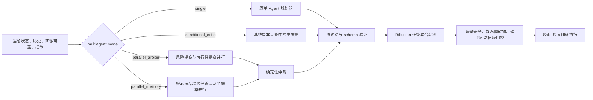
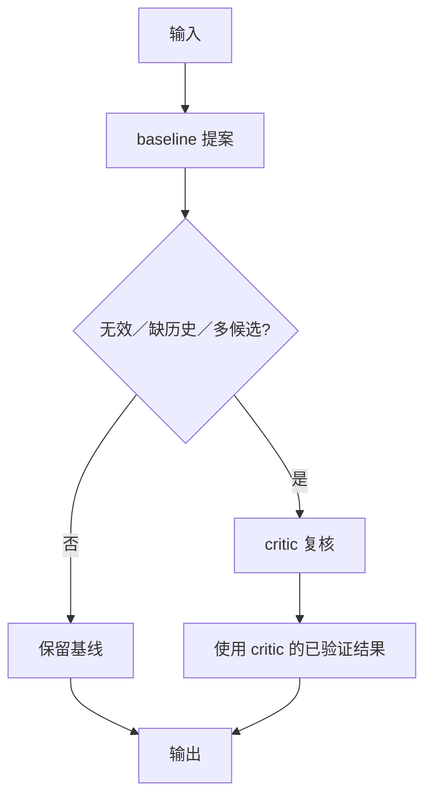
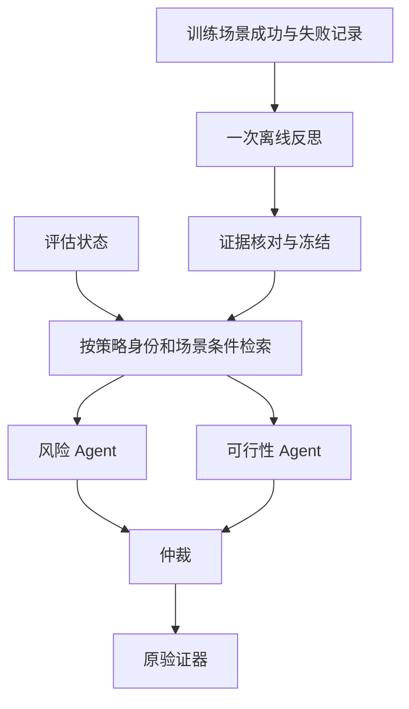

# RiskWeaver 多大模型 Agent 规划流程

## 1. 设计边界

RiskWeaver 的多 Agent 只参与高级离散攻击规划：选择目标交通参与者、策略和四个稀疏锚点。连续多车轨迹仍由 Diffusion 生成，语义验证、背景 OBB 碰撞检查、静态障碍物检查和可达区域检查仍由确定性模块执行。多 Agent 不能放宽这些检查，也不能输出连续控制或 Diffusion 求解器参数。

配置 `sim.llm.multiagent.mode` 有四个值：`single`、`conditional_critic`、`parallel_arbiter`、`parallel_memory`。`single` 直接调用既有规划器，不创建协作控制器，因此默认路径保持原行为。

## 2. 四种模式

### 2.1 `single`：现有单 Agent 基线

一次 LLM 调用直接返回目标、离散策略、四个锚点和理由。代码调用原 `generate_attack_plan` 或画像候选排序函数，不改变参数、提示或对象身份。记录墙钟耗时、调用次数、token、验证结果和执行帧。

### 2.2 `conditional_critic`：单 Agent 加按需质疑

先运行与基线输入相同的提案。只有确定性触发条件出现时才调用 critic：提案无效、缺少历史证据或存在多个结构化候选。critic 读取原提案并输出同一 schema 下的最终方案。任一服务失败都会使本轮协作失败，不能由另一个结果掩盖。

### 2.3 `parallel_arbiter`：双提案加仲裁

两个隔离 worker 并发调用同一模型：风险角色优先寻找自车脆弱点和低反应裕量，可行性角色优先考虑交互可执行性和背景安全。画像模式对两个候选排序做 Borda 聚合；无画像模式中，可行性角色明确“不攻击”会触发 `feasibility_veto`，否则优先选择已经通过原验证器的攻击提案。并行减少两次调用的等待时间，但 token 通常约为单 Agent 的两倍。

### 2.4 `parallel_memory`：双提案加冻结离线复盘

先按自车策略身份、场景条件和规划模式检索最多五条训练集经验，再把相同经验分别提供给风险和可行性角色。经验库保存源记录与 LLM 复盘；人工核对版只陈述实测执行帧、D 和失败原因。训练场景与评估场景重叠时直接报错。仲裁规则与 `parallel_arbiter` 相同，因此该组隔离检验“历史经验是否减少重复失败”。

## 3. 可审计输出

每次协作在 `execution_trace.jsonl` 的 `planner_trace` 中保存：

- `agent_opinions`：每个角色的攻击／不攻击意见、目标、策略和详细理由；
- `critic_triggers`：为什么调用 critic；
- `arbitration_reason` 与 `arbitration_detail`：仲裁规则和本次选择理由；
- `memory_conclusions`：检索到的每条具体结论及证据编号；
- `events[].api_calls`：每个角色的耗时、token、状态和失败类型；
- `selected_plan`、`plan_validation`、`memory_hits`：最终选择和验证状态。

## 4. 与学术界主流方法的关系

这四种流程属于主流的推理时多 Agent 编排范式：按需质疑对应 proposer–critic／verification；双提案加仲裁对应并行 ensemble 与 aggregation；记忆组对应 retrieval-augmented agents 和 reflection memory。这些模式与 AutoGen 的可编程多 Agent 会话、Multi-Agent Debate 的提案—质疑—收敛、Mixture-of-Agents 的多提案聚合具有相同的基本结构。

但 RiskWeaver 当前不是通用 AutoGen 群聊，也不是多轮自由辩论或分层 MoA：角色数固定、最多两次在线调用、通信拓扑固定、仲裁大部分是确定性规则，输出还必须通过自动驾驶领域验证器。准确表述应是“面向危险场景生成的有界、领域约束多 LLM Agent 编排”。这让成本、失败传播和安全边界更容易审计，但多样性和自适应协作能力弱于多轮辩论或动态路由方法。

参考：

- AutoGen: https://arxiv.org/abs/2308.08155
- Multi-Agent Debate: https://arxiv.org/abs/2305.14325
- Mixture-of-Agents: https://arxiv.org/abs/2406.04692
